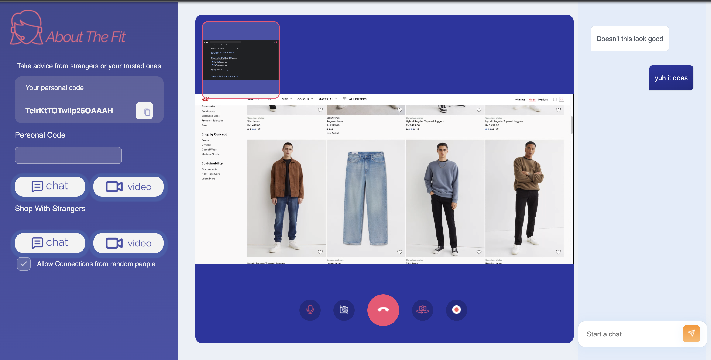
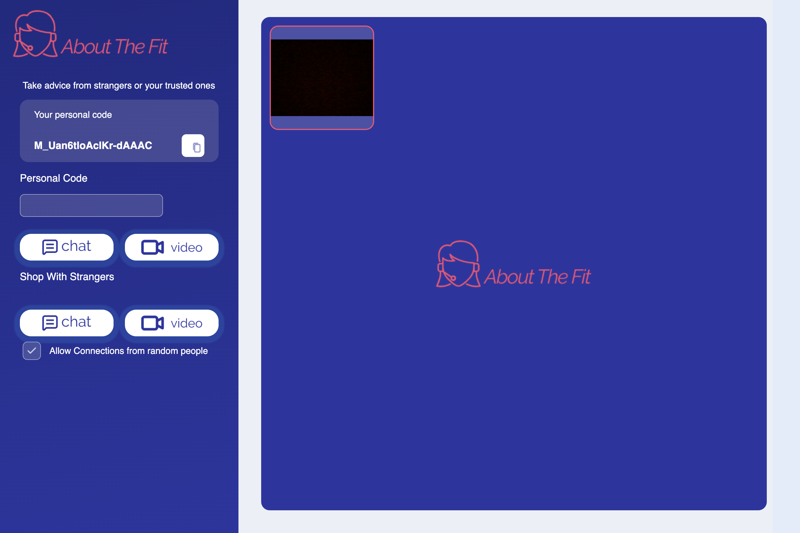

About The Fit
-----
AboutTheFit is an Social hub for fashion holics, on this app you can video-call with your friends to be upto-date with the current-fashion senarios, take thier opinion on you online shopping cart or you can take the advice of random people from the internet, isn't that always a good idea 😂.

### Tech Stack
* **Node.js** and **Express.js** 
* **WebRTC** 
* **SocketIO** 
* **Flask-Migrate** 

 
 


### Development Setup

To start and run the local development server,

1. Initialize and activate a virtualenv:
  ```
  $ cd YOUR_PROJECT_DIRECTORY_PATH/
  $ virtualenv --no-site-packages env
  $ source env/bin/activate
  ```

2. Install the dependencies:
  ```
   $ npm init
   $ npm install express
  ```

3. Run the development server:
  ```
  $ npm run
  ```

4. Navigate to Home page [http://localhost:5000](http://localhost:5000):
